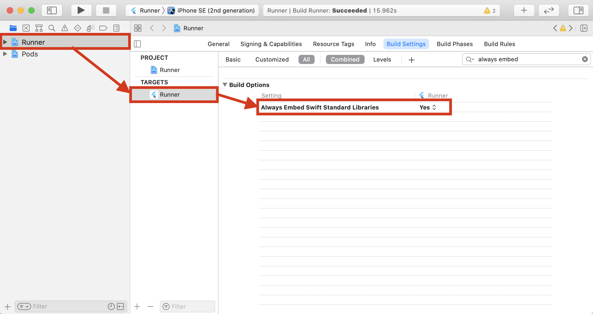
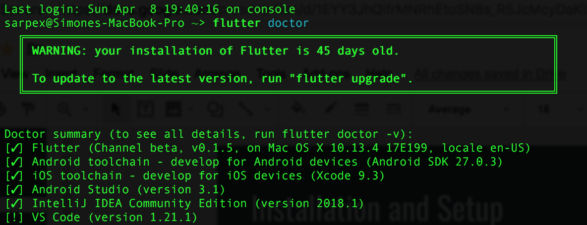

# PSPDFKit Flutter

PSPDFKit wrapper for Flutter.

If you are new to Flutter, make sure to check our blog:

- [How I Got Started With Flutter](https://pspdfkit.com/blog/2018/starting-with-flutter/).
- [Getting Started with PSPDFKit Flutter](https://pspdfkit.com/blog/2019/getting-started-with-pspdfkit-flutter/).

Platform specific README exists for [Android](android/) and [iOS](ios/).

# Setup

## Integration into a New Flutter App

### Android

Let's create a simple app that integrates PSPDFKit and uses the Flutter pspdfkit plugin.

1. Run `flutter create --org com.example.myapp myapp`.
2. Open `myapp/pubspec.yaml` and under `dependencies` add 
```yaml
  pspdfkit_flutter:
    git:
      url: git://github.com/PSPDFKit/pspdfkit-flutter.git
```
<strong>Spaces are important</strong>, so don't forget them.

3. From `myapp` run `flutter packages get` to install the packages.
4. Open `myapp/android/local.properties` and specify the following properties

```local.properties
sdk.dir=/path/to/your/Android/sdk
flutter.sdk=/path/to/your/flutter/sdk
pspdfkit.password=YOUR_MAVEN_KEY_GOES_HERE
flutter.buildMode=debug
```

5. Open `myapp/android/app/build.gradle` and modify `minSdkVersion` from `16` to `21`, enable multiDex, and add compile options to enable desugaring 
  
  ```groovy
  compileOptions {
        sourceCompatibility 1.8
        targetCompatibility 1.8
    }
  ```
  
**Three changes** to edit:

```diff
...
android {
     compileSdkVersion 28
     
+    compileOptions {
+       sourceCompatibility 1.8
+       targetCompatibility 1.8
+   }

    lintOptions {
        disable 'InvalidPackage'
    }

    defaultConfig {
        // TODO: Specify your own unique Application ID (https://developer.android.com/studio/build/application-id.html).
        applicationId "com.example.myapp"
-       minSdkVersion 16
+       minSdkVersion 21
        targetSdkVersion 28
+       multiDexEnabled true
        versionCode flutterVersionCode.toInteger()
        versionName flutterVersionName
        testInstrumentationRunner "android.support.test.runner.AndroidJUnitRunner"
    }
...
```


6. Open `myapp/lib/main.dart` and replace the whole content with a simple example that will load a pdf document from local device filesystem

```dart
import 'package:flutter/material.dart';
import 'package:flutter/services.dart';
import 'package:pspdfkit_flutter/pspdfkit.dart';

void main() => runApp(new MyApp());

class MyApp extends StatefulWidget {
  @override
  _MyAppState createState() => new _MyAppState();
}

class _MyAppState extends State<MyApp> {
  String _frameworkVersion = '';

  void present() {
    Pspdfkit.present("file:///sdcard/document.pdf");
  }

  void showDocument(BuildContext context) async {
    try {
      if (await Pspdfkit.checkAndroidWriteExternalStoragePermission()) {
        present();
      } else {
        AndroidPermissionStatus permissionStatus =
        await Pspdfkit.requestAndroidWriteExternalStoragePermission();
        if (permissionStatus == AndroidPermissionStatus.authorized) {
          present();
        } else if (permissionStatus == AndroidPermissionStatus.deniedNeverAsk) {
          _showToast(context);
        }
      }
    } on PlatformException catch (e) {
      print("Failed to open document: '${e.message}'.");
    }
  }

  @override
  initState() {
    super.initState();
    initPlatformState();
  }

  // Platform messages are asynchronous, so we initialize in an async method.
  void initPlatformState() async {
    String frameworkVersion;
    // Platform messages may fail, so we use a try/catch PlatformException.
    try {
      frameworkVersion = await Pspdfkit.frameworkVersion;
    } on PlatformException {
      frameworkVersion = 'Failed to get platform version. ';
    }

    // If the widget was removed from the tree while the asynchronous platform
    // message was in flight, we want to discard the reply rather than calling
    // setState to update our non-existent appearance.
    if (!mounted) return;

    setState(() {
      _frameworkVersion = frameworkVersion;
    });

    // Replace
    Pspdfkit.setLicenseKey("YOUR_LICENSE_KEY_GOES_HERE");
  }

  void _openSettings(ScaffoldState scaffold) {
    scaffold.hideCurrentSnackBar();
    Pspdfkit.openAndroidSettings();
  }

  void _showToast(BuildContext context) {
    final scaffold = Scaffold.of(context);
    scaffold.showSnackBar(
      SnackBar(
        content: const Text('PSPDFKit Flutter example requires file system permissions to open a PDF document into the sdcard folder.'),
        action: SnackBarAction(
            label: 'Open Settings', onPressed: () => _openSettings(scaffold)
        ),
      ),
    );
  }

  @override
  Widget build(BuildContext context) {
    final ThemeData themeData = Theme.of(context);

    return new MaterialApp(
      home: new Scaffold(
          appBar: new AppBar(
            title: new Text('PSPDFKit Flutter Plugin example app'),
          ),
          body: Builder(
            // Create an inner BuildContext so that the onPressed methods
            // can refer to the Scaffold with Scaffold.of().
            builder: (BuildContext context) {
              return Center(
                  child: new Column(
                      mainAxisAlignment: MainAxisAlignment.spaceEvenly,
                      children: [
                        new Text('PSPDFKit for $_frameworkVersion\n',
                            style: themeData.textTheme.display1
                                .copyWith(fontSize: 21.0)),
                        new RaisedButton(
                            child: new Text('Tap to Open Document',
                                style: themeData.textTheme.display1
                                    .copyWith(fontSize: 21.0)),
                            onPressed: () => showDocument(context))
                      ]));
            },
          )),
    );
  }
}
```

7. In `lib/main.dart` replace `YOUR_LICENSE_KEY_GOES_HERE` with your PSPDFKit license key.

8. Before launching the app you need to copy a PDF document onto your development device or emulator
```bash
adb push /path/to/your/document.pdf /sdcard/document.pdf
```

9. The app is ready to start! From `myapp` run `flutter run`.

## iOS

1. Run `flutter create --org com.example.myapp myapp`.
2. Step into your newly created app folder: `cd myapp`
3. Open `pubspec.yaml` and under `dependencies` add

```yaml
  path_provider: ^0.4.1
  pspdfkit_flutter:
    git:
      url: git://github.com/PSPDFKit/pspdfkit-flutter.git
```

4. Add a `PDFs` directory with a document in it in the root directory: `myapp/PDFs/Guide_v4.pdf` and specify it in your `pubspec.yaml`:

```yaml
  assets:
    - PDFs/   
```
<strong>Spaces are important</strong>, so don't forget them.

5. Open the `Runner.xcworkspace` from the `ios` folder in Xcode: `open ios/Runner.xcworkspace`
6. Make sure the `iOS Deployment Target` is set to 11.0 or higher. 


7. Change "View controller-based status bar appearance" to YES in `Info.plist`.


8. If your application is targeting iOS versions **prior to iOS 12.2** and your application **does not already contain any Swift code**, then you need to make sure Xcode bundles Swift standard libraries with your application distribution. To to so, open your target Build Settings and enable `Always Embed Swift Standard Libraries`:



9. Run `flutter packages get` to install the packages.
10. Open the `Podfile`: `open ios/Podfile` and edit it as follows:

```diff
# Uncomment this line to define a global platform for your project
-   # platform :ios, '9.0'
+   platform :ios, '11.0'
...
target 'Runner' do
  use_frameworks!
+   pod 'PSPDFKit', podspec:'https://customers.pspdfkit.com/cocoapods/YOUR_COCOAPODS_KEY_GOES_HERE/pspdfkit/latest.podspec'
...
end  
``` 

11. Open `lib/main.dart` and replace the whole content with a simple example that will load a PDF document from local device filesystem:

```dart
import 'dart:io';
import 'dart:typed_data';

import 'package:flutter/cupertino.dart';
import 'package:flutter/material.dart';
import 'package:flutter/services.dart';
import 'package:path_provider/path_provider.dart';
import 'package:pspdfkit_flutter/pspdfkit.dart';

const String DOCUMENT_PATH = 'PDFs/Guide_v4.pdf';
const String PSPDFKIT_FLUTTER_PLUGIN_TITLE = 'PSPDFKit Flutter Plugin example app';
const String OPEN_DOCUMENT_BUTTON = 'Tap to Open Document';
const String PSPDFKIT_FOR = 'PSPDFKit for';
const double FONT_SIZE = 21.0;

void main() => runApp(new MyApp());

class MyApp extends StatefulWidget {
  @override
  _MyAppState createState() => new _MyAppState();
}

class _MyAppState extends State<MyApp> {
  String _frameworkVersion = '';

  void showDocument() async {
    try {
      final ByteData bytes = await DefaultAssetBundle.of(context).load(DOCUMENT_PATH);
      final Uint8List list = bytes.buffer.asUint8List();

      final tempDir = await getTemporaryDirectory();
      final tempDocumentPath = '${tempDir.path}/$DOCUMENT_PATH';

      final file = await new File(tempDocumentPath).create(recursive: true);
      file.writeAsBytesSync(list);

      Pspdfkit.present(tempDocumentPath);
    } on PlatformException catch (e) {
      print("Failed to open document: '${e.message}'.");
    }
  }

  @override
  initState() {
    super.initState();
    initPlatformState();
  }

  String frameworkVersion() {
    return '$PSPDFKIT_FOR $_frameworkVersion\n';
  }

  // Platform messages are asynchronous, so we initialize in an async method.
  void initPlatformState() async {
    String frameworkVersion;
    // Platform messages may fail, so we use a try/catch PlatformException.
    try {
      frameworkVersion = await Pspdfkit.frameworkVersion;
    } on PlatformException {
      frameworkVersion = 'Failed to get platform version. ';
    }

    // If the widget was removed from the tree while the asynchronous platform
    // message was in flight, we want to discard the reply rather than calling
    // setState to update our non-existent appearance.
    if (!mounted) return;

    setState(() {
      _frameworkVersion = frameworkVersion;
    });

    // Replace
    Pspdfkit.setLicenseKey("YOUR_LICENSE_KEY_GOES_HERE");
  }

  @override
  Widget build(BuildContext context) {
    final ThemeData themeData = Theme.of(context);
    return new CupertinoApp(
      home: new CupertinoPageScaffold(
        navigationBar: CupertinoNavigationBar(
            middle: Text(PSPDFKIT_FLUTTER_PLUGIN_TITLE,
                style: themeData.textTheme.title
            )
        ),
        child: new Center(
            child: new Column(
                mainAxisAlignment: MainAxisAlignment.spaceEvenly,
                children: [
                  new Text(frameworkVersion(),
                      style: themeData.textTheme.display1.copyWith(fontSize: FONT_SIZE)),
                  new CupertinoButton(
                      child: new Text(OPEN_DOCUMENT_BUTTON),
                      onPressed: showDocument)
                ])),
      ),
    );
  }
}
```

12. In `lib/main.dart` replace `YOUR_LICENSE_KEY_GOES_HERE` with your PSPDFKit license key.
13. Run `flutter emulators --launch apple_ios_simulator` to launch the iOS Simulator.
14. Run `flutter run`.

# Example

To see PSPDFKit Flutter in action check out our [Flutter example app](example/).

Showing a PDF document inside your Flutter app is as simple as this:

```MyApp.dart 
showDocument() async {
    try {
        Pspdfkit.present("file:///document.pdf");
    } on PlatformException catch (e) {
        print("Failed to open document: '${e.message}'.");
    }
}
```
# Contributing

Please ensure [you signed our CLA](https://pspdfkit.com/guides/web/current/miscellaneous/contributing/) so we can accept your contributions.

# Troubleshooting

## Flutter Updates

To update Flutter to the latest version, all you have to do is run `flutter upgrade`.

## Flutter Configuration Problems

Among the tools provided by Flutter, there is `flutter doctor`, a very handy program that checks your system configuration for you and provides step-by-step actions to take in case of problems.



The verbose mode of flutter doctor is even more helpful; it prints out extensive information about the nature of an issue and how to fix it. To run the verbose mode, all you have to do is type `flutter doctor -d`.

### CocoaPods Conflicts With Asdf

If [asdf](https://github.com/asdf-vm/asdf) is installed in your machine it might create problems when running Cocoapods, and Flutter will erroneusly suggest to install CocoaPods via brew with `brew install cocoapods`. This won't work because for this specific configuration CocoaPods needs to be installed via [RubyGems](https://rubygems.org/). To fix this configuration issue just type `gem install cocoapods && pod setup`.

## Error When Running on Android: Cannot Find Symbol `PSPDFKit`

Verify that your Maven key has been correctly inserted in your `myapp/android/local.properties`

```local.properties
sdk.dir=/path/to/your/Android/sdk
flutter.sdk=/path/to/your/flutter/sdk
pspdfkit.password=YOUR_MAVEN_KEY_GOES_HERE
flutter.buildMode=debug
```

Make sure that the Maven key has not been confused with the license key. The Maven key is generally shorter and for demo licenses it starts with `TRIAL-`.

