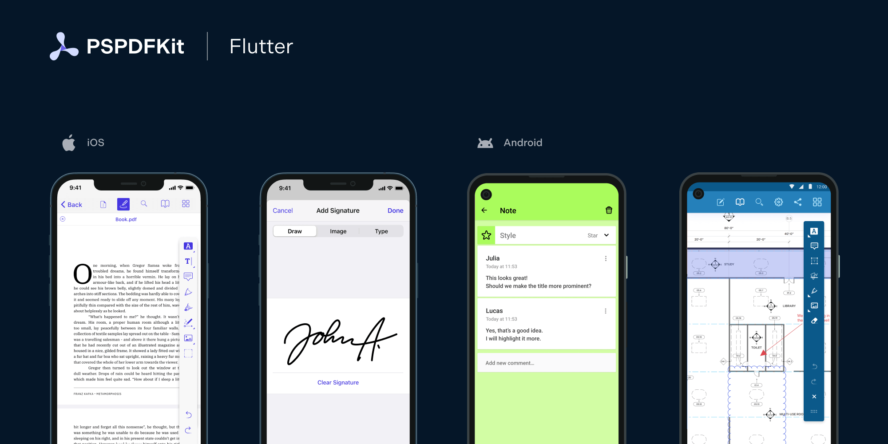
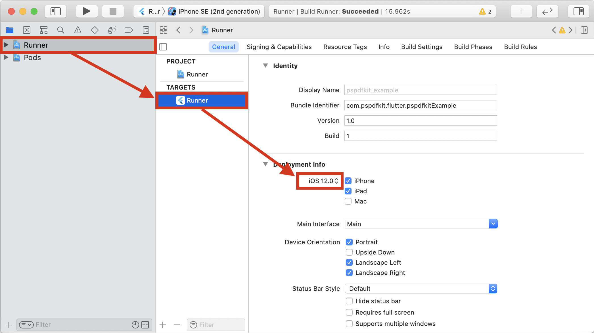
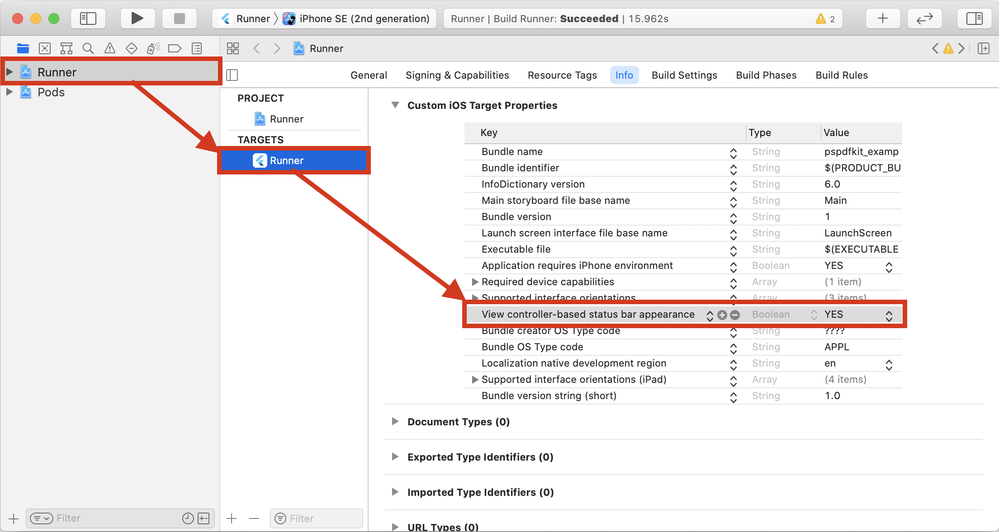

# Flutter PDF Library by PSPDFKit



PSPDFKit for Flutter is an SDK for viewing, annotating, and editing PDFs. It offers developers the ability to quickly add PDF functionality to any Flutter application. It is available at [pub.dev](https://pub.dev/packages/pspdfkit_flutter) and [GitHub](https://github.com/PSPDFKit/pspdfkit-flutter).

If you are new to Flutter, make sure to check our Flutter blog posts:

- [How I Got Started With Flutter](https://pspdfkit.com/blog/2018/starting-with-flutter/).
- [Getting Started with Flutter PDF Library by PSPDFKit](https://pspdfkit.com/blog/2019/getting-started-with-pspdfkit-flutter/).
- [Opening a PDF in Flutter](https://pspdfkit.com/blog/2019/opening-a-pdf-in-flutter/).
- [How to Bridge Native iOS Code to Flutter](https://pspdfkit.com/blog/2021/how-to-bridge-native-ios-code-to-flutter/).
- [How to Customize Our Flutter PDF SDK for Android](https://pspdfkit.com/blog/2021/how-to-customize-our-flutter-pdf-sdk/).
- [Advances in Hybrid Technologies](https://pspdfkit.com/blog/2019/advances-in-hybrid-technologies/).
- [How We Maintain Our Public Flutter Project Using a Private Monorepo](https://pspdfkit.com/blog/2021/maintaining-open-source-repo-from-monorepo/).
- [How to Download and Display a PDF Document in Flutter with PSPDFKit](https://pspdfkit.com/blog/2022/download-and-display-pdf-in-flutter-with-pspdfkit/).

For our quick-start guides, [check out our website](https://pspdfkit.com/getting-started/mobile/?frontend=flutter).

Platform specific README exists for [Android](android/) and [iOS](ios/).

# Setup

## Integration into a New Flutter App

### Android

#### Requirements

- The [latest stable version of Flutter][install-flutter]
- The [latest stable version of Android Studio][android studio]
- The [Android NDK][install ndk]
- An [Android Virtual Device][managing avds] or a hardware device

#### Getting Started

1. Create a Flutter project called `pspdfkit_demo` with the `flutter` CLI:

    ```bash
    flutter create --org com.example.pspdfkit_demo pspdfkit_demo
    ```

2. In the terminal app, change the location of the current working directory to your project:

    ```bash
    cd pspdfkit_demo
    ```
3. Open the project’s main activity class, `android/app/src/main/kotlin/com/example/pspdfkit_demo/pspdfkit_demo/MainActivity.kt`:

    ```bash
    open android/app/src/main/kotlin/com/example/pspdfkit_demo/pspdfkit_demo/MainActivity.kt
    ```

4. Modify the base from `FlutterActivity` to `FlutterFragmentActivity`:

    ```diff
     package com.example.pspdfkit_demo.pspdfkit_demo

    -import io.flutter.embedding.android.FlutterActivity
    +import io.flutter.embedding.android.FlutterFragmentActivity

    -class MainActivity: FlutterActivity() {
    +class MainActivity: FlutterFragmentActivity() {
     }
    ```

5. Open the project’s Gradle build file, `android/build.gradle`:

   ```bash
   open android/build.gradle
   ```

6. Modify the Kotlin version inside the `buildscript` section:

    ```diff
     buildscript {
    -    ext.kotlin_version = '1.3.50'
    +    ext.kotlin_version = '1.5.31'
         repositories {
             google()
             mavenCentral()
         }
     ...
    ```

7. Open the app’s Gradle build file, `android/app/build.gradle`:

    ```bash
    open android/app/build.gradle
    ```

8. Modify the minimum SDK version, and enable `multidex`. All this is done inside the `android` section:

    ```diff
     android {
         defaultConfig {
    -        minSdkVersion flutter.minSdkVersion
    +        minSdkVersion 21
             ...
    +        multiDexEnabled true
         }
     }
    ```

9. Open `pubspec.yaml`:

    ```bash
    open pubspec.yaml
    ```

10. Add the PSPDFKit dependency in `pubspec.yaml`:

    ```diff
     dependencies:
       flutter:
         sdk: flutter
    +  pspdfkit_flutter: any
    ```

11.  From the terminal app, run the following command to get all the packages:

    ```bash
    flutter pub get
    ```

12. Then run the command below to upgrade the dependencies:

    ```bash
    flutter pub upgrade
    ```

13. Open `lib/main.dart` and replace the entire content with the contents of [demo_project_main.dart.txt](doc/demo_project_main.dart.txt). This simple example will load a PDF document from local device filesystem.

14. Add the PDF document you want to display in your project’s `assets` directory.
    - First create a `PDFs` directory:

        ```bash
        mkdir PDFs
        ```

    - Move a [sample document](example/PDFs/PSPDFKit.pdf) into the newly created `PDFs` directory, and rename it as `Document.pdf`:

        ```bash
        cp ~/Downloads/PSPDFKit.pdf PDFs/Document.pdf
        ```

15. Specify the `assets` directory in `pubspec.yaml`:

    ```diff
     # The following section is specific to Flutter.
     flutter:
    +  assets:
    +    - PDFs/
     ...
    ```

16. [Start your Android emulator][start-the-emulator], or connect a device.

17. Run the app with:

    ```bash
    flutter run
    ```

### iOS

#### Requirements

- The [latest stable version of Flutter][install-flutter]
- The [latest stable version of Xcode][xcode]
- The [latest stable version of CocoaPods][cocoapods releases]

#### Getting Started

1. Create a Flutter project called `pspdfkit_demo` with the `flutter` CLI:

    ```bash
    flutter create --org com.example.pspdfkit_demo pspdfkit_demo
    ```

2. In the terminal app, change the location of the current working directory to your project:

    ```bash
    cd pspdfkit_demo
    ```

3. Open `Runner.xcworkspace` from the `ios` folder in Xcode:

    ```bash
    open ios/Runner.xcworkspace
    ```

4. Make sure the `iOS Deployment Target` is set to 14.0 or higher.

    

5. Change "View controller-based status bar appearance" to YES in `Info.plist`.

    

6. Add the PSPDFKit dependency in `pubspec.yaml`:

    ```diff
     dependencies:
       flutter:
         sdk: flutter
    +  pspdfkit_flutter:
    ```

7. From the terminal app, run the following command to get all the packages:

    ```bash
    flutter pub get
    ```

8. Then run the command below to upgrade the dependencies:

    ```bash
    flutter pub upgrade
    ```

9. Open your project’s Podfile in a text editor:

    ```bash
    open ios/Podfile
    ```

10. Update the platform to iOS 14 and add the PSPDFKit Podspec:

    ```diff
    -# platform :ios, '9.0'
    + platform :ios, '14.0'
     ...
     target 'Runner' do
       use_frameworks!
       use_modular_headers!`

       flutter_install_all_ios_pods File.dirname(File.realpath(__FILE__))
    +  pod 'PSPDFKit', podspec:'https://customers.pspdfkit.com/pspdfkit-ios/latest.podspec'
     end
    ```

11. Open `lib/main.dart` and replace the entire content with the contents of [demo_project_main.dart.txt](doc/demo_project_main.dart.txt). This simple example will load a PDF document from local device filesystem.

12. Add the PDF document you want to display in your project’s `assets` directory.
    - First create a `PDFs` directory:

        ```bash
        mkdir PDFs
        ```

    - Move a [sample document](example/PDFs/PSPDFKit.pdf) into the newly created `PDFs` directory, and rename it as `Document.pdf`:

        ```bash
        cp ~/Downloads/PSPDFKit.pdf PDFs/Document.pdf
        ```

13. Specify the `assets` directory in `pubspec.yaml`:

    ```diff
     # The following section is specific to Flutter.
     flutter:
    +  assets:
    +    - PDFs/
     ...
    ```

14. Run `flutter emulators --launch apple_ios_simulator` to launch the iOS Simulator.

15. Run the app with:

    ```bash
    flutter run
    ```

# Example App

To see PSPDFKit for Flutter in action check out our [Flutter example app](example/).

Showing a PDF document inside your Flutter app is as simple as this:

    ```dart
    Pspdfkit.present('file:///path/to/Document.pdf');
    ```

# Upgrading to a Full PSPDFKit License Key

PSPDFKit is a commercial product and requires the purchase of a license key when used in production. By default, this library will
initialize in demo mode, placing a watermark on each PDF and limiting usage to 60 minutes.

To purchase a license for production use, please reach out to us via https://pspdfkit.com/sales/form/.

To initialize PSPDFKit using a license key, call either of the following before using any other PSPDFKit APIs or features:

To set the license key for both Android and iOS, use:
```
await Pspdfkit.setLicenseKeys("YOUR_FLUTTER_ANDROID_LICENSE_KEY_GOES_HERE", "YOUR_FLUTTER_IOS_LICENSE_KEY_GOES_HERE");
```

To set the license key for the currently running platform, use:
```
await Pspdfkit.setLicenseKey("YOUR_FLUTTER_LICENSE_KEY_GOES_HERE");
```

# Migrating from Previous Version

To upgrade PSPDFKit for Flutter in your app, please refer to the [Upgrade and Migration Guides][flutter upgrade] section.

# Troubleshooting

For Troubleshooting common issues you might encounter when setting up PSPDFKit for Flutter, please refer to the [Troubleshooting][] section.


<!-- References -->

[install-flutter]: https://flutter.dev/docs/get-started/install
[android studio]: https://developer.android.com/studio
[install ndk]: https://developer.android.com/studio/projects/install-ndk
[managing avds]: https://developer.android.com/studio/run/managing-avds.html
[xcode]: https://apps.apple.com/us/app/xcode/id497799835?mt=12
[cocoapods releases]: https://github.com/CocoaPods/CocoaPods/releases
[start-the-emulator]: https://developer.android.com/studio/run/emulator#runningemulator
[flutter upgrade]: https://pspdfkit.com/guides/flutter/upgrade/
[troubleshooting]: https://pspdfkit.com/guides/flutter/troubleshoot/
