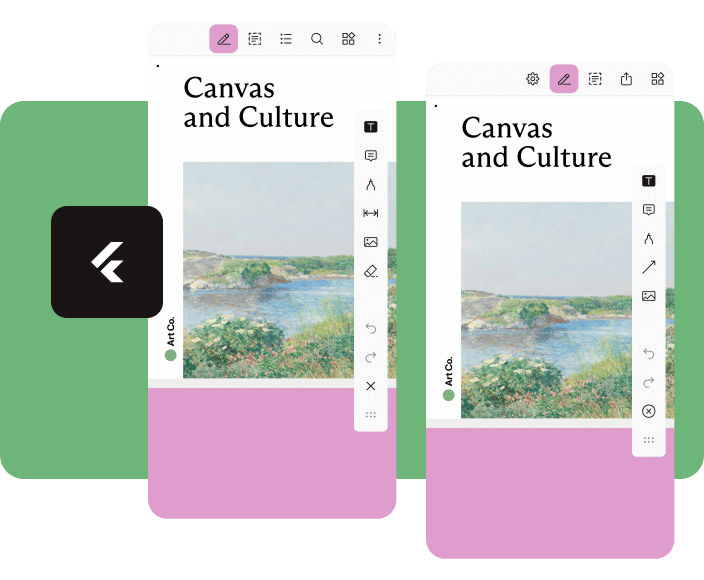

# Flutter Document SDK by Nutrient

Add powerful PDF functionality to your Flutter apps with the Nutrient Flutter SDK. View, annotate, and edit PDFs seamlessly across Android, iOS, and Web platforms.



## Requirements

- Flutter 3.44.6 or later
- For Android:
  - Android Studio (latest stable version)
  - Android NDK
  - Android API level 24 or later
  - Android Virtual Device or physical device
- For iOS:
  - Xcode 16 or later
  - iOS 17.0 or later
- For Web:
  - Modern web browser with WebAssembly support

## Installation

1. Add the Nutrient Flutter SDK to your `pubspec.yaml`:

```yaml
dependencies:
  nutrient_flutter: ^6.0.0
```

If you are building against the [bindings API](#bindings-api) — recommended for
new applications — also add the platform packages as direct dependencies, so
the federated plugins are registered at runtime:

```yaml
dependencies:
  nutrient_flutter: ^6.0.0
  nutrient_flutter_platform_interface: ^2.0.0
  nutrient_flutter_android: ^2.0.0
  nutrient_flutter_ios: ^2.0.0
  nutrient_flutter_web: ^2.0.0
```

2. Run the following command:

```bash
flutter pub get
```

## Platform Setup

### Android Setup

1. Update your Android configuration in `android/app/build.gradle`:

```gradle
android {
    compileSdkVersion 36
    
    defaultConfig {
        minSdkVersion 24
    }
    
    compileOptions {
        sourceCompatibility JavaVersion.VERSION_17
        targetCompatibility JavaVersion.VERSION_17
    }

    kotlinOptions {
        jvmTarget = '17'
    }
}

dependencies {
    implementation 'androidx.appcompat:appcompat:<version>'
}
```

2. Update your theme in `android/app/src/main/res/values/styles.xml`:

```diff
- <style name="NormalTheme" parent="Theme.AppCompat.Light.NoActionBar">
+ <style name="NormalTheme" parent="PSPDFKit.Theme.Default">
```

3. Update your main activity to use `FlutterAppCompatActivity`:

```kotlin
import io.flutter.embedding.android.FlutterAppCompatActivity

class MainActivity: FlutterAppCompatActivity() {
}
```

**Note:** As of 6.0.0 this class ships in `nutrient_flutter_android`. The import
path is unchanged, and it is still available when you depend on
`nutrient_flutter`. Its built-in `AiAssistantProvider` integration was removed —
if you relied on it, re-add it in your own app module as described in the
[bindings migration guide](documentation/bindings-migration-guide.md).

### iOS Setup

Make sure to set the minimum iOS version to 17.0 in your `ios/Podfile`:

```ruby
platform :ios, '17.0'
```

### Web Setup

You can include the Nutrient Web SDK using either CDN or local installation:

#### Option 1: CDN (Recommended)

Add the following script to your `web/index.html` file:

```html
<script src="https://cdn.cloud.nutrient.io/pspdfkit-web@1.17.0/nutrient-viewer.js"></script>
```

**Note:** Replace `1.17.0` with the latest version of Nutrient Web SDK. Check the [latest releases][web changelog] for the current version.

#### Option 2: Local Installation

1. [Download Nutrient Web SDK][download web sdk]. The download will start immediately and save a `.tar.gz` archive like `PSPDFKit-Web-binary-<version>.tar.gz` to your computer.

2. Once downloaded, extract the archive and copy the **entire** contents of its `dist` folder to your project's `web/assets` folder.

3. Verify your `assets` folder contains:
   - `nutrient-viewer.js` file
   - `nutrient-viewer-lib` directory with library assets

4. Add the Nutrient library to your `web/index.html`:

```html
<script src="assets/nutrient-viewer.js"></script>
```

Note: Your server must have the `Content-Type: application/wasm` MIME type configured for WebAssembly files.

## Sample Document Setup

1. Create a `PDFs` directory in your project root:

```bash
mkdir PDFs
```

2. Download our [sample PDF document][sample document] and save it as `Document.pdf` in the `PDFs` directory.

3. Add the assets directory to your `pubspec.yaml`:

```yaml
flutter:
  assets:
    - PDFs/
```

## Usage

Create a new file `lib/main.dart` with the following content:

```dart
import 'package:flutter/material.dart';
import 'package:nutrient_flutter/nutrient_flutter.dart';
import 'dart:io';
import 'package:flutter/foundation.dart';

const String documentPath = 'PDFs/Document.pdf';

void main() async {
  WidgetsFlutterBinding.ensureInitialized();

  // Initialize the Nutrient SDK with your license key
  await Nutrient.initialize(
    androidLicenseKey: 'YOUR_ANDROID_LICENSE_KEY',
    iosLicenseKey: 'YOUR_IOS_LICENSE_KEY',
    webLicenseKey: 'YOUR_WEB_LICENSE_KEY',
  );

   runApp(const MaterialApp(
    home: MyApp(),
  ));
}

class MyApp extends StatelessWidget {
  const MyApp({super.key});

  Future<String> extractAsset(BuildContext context, String assetPath) async {

    if (kIsWeb) {
      return assetPath;
    }

    final bytes = await DefaultAssetBundle.of(context).load(assetPath);
    final list = bytes.buffer.asUint8List();
    final tempDir = await Nutrient.getTemporaryDirectory();
    final tempDocumentPath = '${tempDir.path}/$assetPath';
    final file = File(tempDocumentPath);

    await file.create(recursive: true);
    file.writeAsBytesSync(list);
    return file.path;
  }

  @override
  Widget build(BuildContext context) {
    return Scaffold(
      body: FutureBuilder<String>(
          future: extractAsset(context, documentPath),
          builder: (context, snapshot) {
            if (snapshot.hasData) {
              /// NutrientView is a widget that displays a PDF document.
              return NutrientView(
                documentPath: snapshot.data!,
              );
            } else if (snapshot.hasError) {
              return Center(
                child: Text('${snapshot.error}'),
              );
            } else {
              return const Center(
                child: CircularProgressIndicator(),
              );
            }
          }),
    );
  }
}
```

**Note:** Replace `'YOUR_ANDROID_LICENSE_KEY'`, `'YOUR_IOS_LICENSE_KEY'`, and `'YOUR_WEB_LICENSE_KEY'` with your actual license keys. Do not pass any license keys if you want to run the SDK in demo mode, the SDK will run in demo mode with a watermark.

## Bindings API

The example above uses the original API, imported from
`package:nutrient_flutter/nutrient_flutter.dart`.

As of 6.0.0, the **bindings API** is the recommended surface for new
applications. It is a separate entry point:

```dart
import 'package:nutrient_flutter/bindings.dart';
```

It gives you `NutrientDocumentView` with a typed `controller.events` stream,
platform adapters for reaching native SDK APIs that the cross-platform surface
does not cover yet, and `NutrientInstantView` for real-time collaboration.
Bindings applications must list the platform packages as direct dependencies —
see [Installation](#installation).

Start with the [bindings migration guide](documentation/bindings-migration-guide.md).

### Upgrading from 5.x

6.0.0 removes the legacy `MethodChannel` bridge, including `Pspdfkit.useLegacy`
and the `useLegacy:` parameter on `Pspdfkit.initialize(...)`. See the
[removal notes](documentation/legacy-method-channel-removal.md) for what to
change, and the [CHANGELOG](CHANGELOG.md) for the full list of breaking changes.

## Learn More

- [Documentation][documentation]
- [Example Projects][example project]
- [Release Notes][release notes]
- [Customization][customization]
- [Migration Guide][migration guide]
- [Bindings Migration Guide](documentation/bindings-migration-guide.md) - Move to the recommended bindings API
- [Legacy MethodChannel Removal](documentation/legacy-method-channel-removal.md) - What changed in 6.0.0 and how to migrate
- [Working with Annotations](documentation/annotations-api-guide.md) - Read, create, search, and remove annotations with typed models
- [Working with Forms](documentation/forms-api-guide.md) - Read AcroForm fields as typed models and fill them in
- [Working with Events](documentation/events-api-guide.md) - React to document, annotation, and form changes through one typed stream
- [Customizing the Toolbars](documentation/toolbar-customization-guide.md) - Reorder, group, and extend the main and annotation toolbars from Dart
- [Headless Document API](documentation/headless-document-api-guide.md) - Open documents without a viewer for batch processing
- [Dirty State Tracking](documentation/dirty-state-tracking-guide.md) - Track unsaved changes across platforms
- [Configuring Signatures](documentation/signature-configuration-guide.md) - Customize the signature creation UI and saving strategy
- [Intercepting the Signature Flow](documentation/signature-interceptor-guide.md) - Choose a signature's thickness, opacity and placement from Dart

## Support

Visit our [Support Center][support] for help with the SDK.

## License

This project is licensed under the Nutrient Commercial License. See [LICENSE][license file] for details.

[documentation]: https://www.nutrient.io/guides/flutter/
[example project]: https://github.com/PSPDFKit/pspdfkit-flutter
[release notes]: https://www.nutrient.io/changelog/flutter
[customization]: https://www.nutrient.io/guides/flutter/customize/
[migration guide]: https://nutrient.io/guides/flutter/upgrade/
[support]: https://support.nutrient.io
[download web sdk]: https://my.nutrient.io/download/web/latest
[sample document]: https://www.nutrient.io/downloads/pspdfkit-web-demo.pdf
[web changelog]: https://www.nutrient.io/changelog/web/
[license file]: LICENSE
